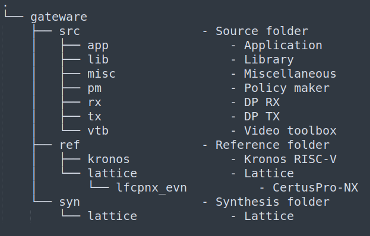
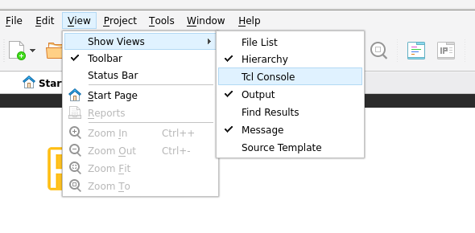
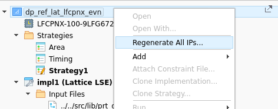

Build
=====

The DP IP-cores and reference design can be downloaded from the Github repository at https://github.com/Parretto/DisplayPort

The repository file structure is listed in figure 1.

Figure 1: Repository tree

.. comment
.
└── gateware
    ├── src 				- Source folder
    │	├── app					- Application
    │	├── lib					- Library
    │	├── misc				- Miscellaneous
    │	├── pm					- Policy maker
    │	├── rx					- DP RX
    │	├── tx					- DP TX
    │	└── vtb					- Video toolbox
    ├── ref					- Reference folder
    │	├── kronos				- Kronos RISC-V 
    │	└── lattice				- Lattice
    │   	└── lfcpnx_evn			- CertusPro-NX 
    └── syn					- Synthesis folder
        └── lattice				- Lattice

Kronos RISC-V
^^^^^^^^^^^^^
In the reference design the Kronos RISC-V is used as a generic application processor. 
More information about he Kronos can be found here; https://sonalpinto.github.io/kronos/#/
|**This processor is not part of the DP IP-core itself.**
It can be replaced by any hard or soft-core processor (eg. ARM, RISC-V, Microblaze, etc)

Lattice CertusPro-NX reference design
^^^^^^^^^^^^^^^^^^^^^^^^^^^^^^^^^^^^^
Steps to build the reference design. 

#. Change the work directory to the folder gateware/syn/lattice
#. Launch the Lattice Radiant software
#. Open the TCL console (View -> Show Views -> TCL Console) - Figure 2
#. Build the project by typing in the TCL console; source ../../ref/lattice/lfcpnx_evn/build_proj.tcl
#. In the file list right click on the project name (dp_ref_lat_lfcpnx_evn) 
#. Select 'Regenerate All IPs...' and click OK. - Figure 3
#. Press the big green 'Run All' button on top left to start the compilation

-----

Figure 2: TCL-console

-----

Figure 3: Regenerate All IPs

-----
