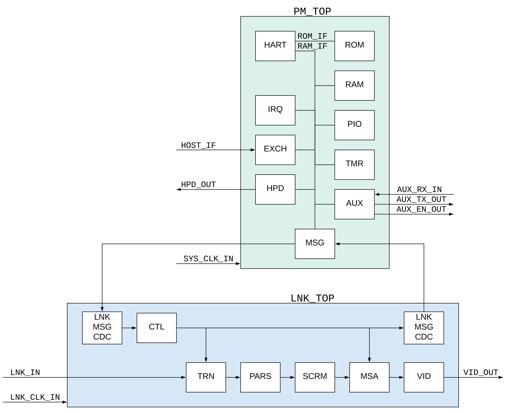

Receiver (DPRX)
===============

The DPRX diagram is shown in figure 2.

   
   Figure 2: DPRX diagram

.. list-table:: Parameters
    :widths: 10 10 10 10
    :header-rows: 1

    * - Name
      - Type
      - Description
      - Values
    * - P_VENDOR
      - String
      - Vendor
      - Xilinx, Lattice
    * - P_BEAT
      - Integer
      - Beat value
      - 100
    * - P_LANES
      - Integer
      - Number of lanes
      - 2, 4
    * - P_SPL
      - Integer
      - Symbols per lane
      - 2, 4
    * - P_PPC
      - Integer
      - Pixels per clock
      - 2, 4
    * - P_BPC
      - Integer
      - Bits per component
      - 8

.. list-table:: Signals
    :widths: 10 10 10 10
    :header-rows: 1

    * - Name
      - Clock 
      - Description
      - Width
    * - SYS_RST_IN
      - SYS_CLK
      - System reset
      - 1
    * - SYS_CLK_IN
      - SYS_CLK
      - System clock (100 MHz)
      - 1
    * - HOST_IF
      - SYS_CLK
      - Host interface
      - 
    * - HOST_IRQ_OUT
      - SYS_CLK
      - Host interrupt
      - 1
    * - AUX_EN_OUT
      - SYS_CLK
      - AUX channel enable
      - 1
    * - AUX_TX_OUT
      - SYS_CLK
      - AUX channel transmit
      - 1
    * - AUX_RX_IN
      - SYS_CLK
      - AUX channel receive
      - 1
    * - HPD_OUT
      - SYS_CLK
      - Hot Plug Detect
      - 1
    * - HB_OUT
      - SYS_CLK
      - Heartbeat
      - 1
    * - LNK_CLK_IN
      - LNK_CLK
      - Link clock
      - 1
    * - LNK_DAT_IN
      - LNK_CLK
      - Link data
      - P_LANES * P_SPL * 9
    * - VID_RDY_IN
      - LNK_CLK
      - Video ready
      - 1
    * - VID_SOF_OUT
      - LNK_CLK
      - Video start of frame
      - 1
    * - VID_EOL_OUT
      - LNK_CLK
      - Video end of line
      - 1
    * - VID_DAT_OUT
      - LNK_CLK
      - Video data 
      - P_VID
    * - VID_VLD_OUT
      - LNK_CLK
      - Video valid
      - 1

