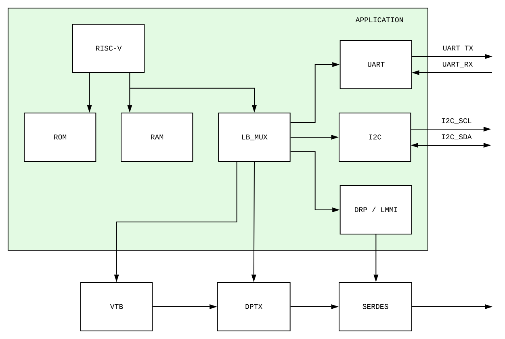
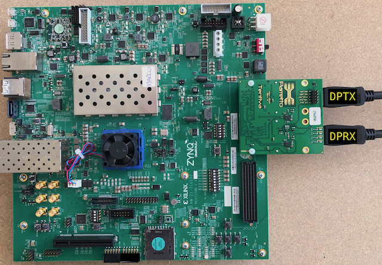
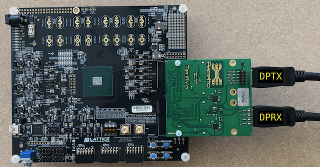
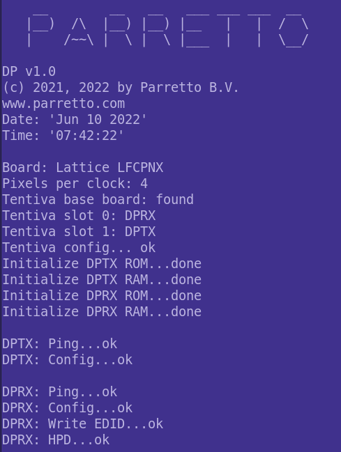
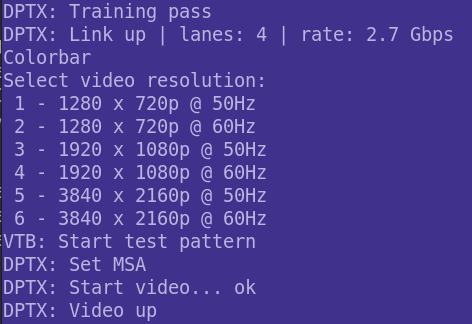
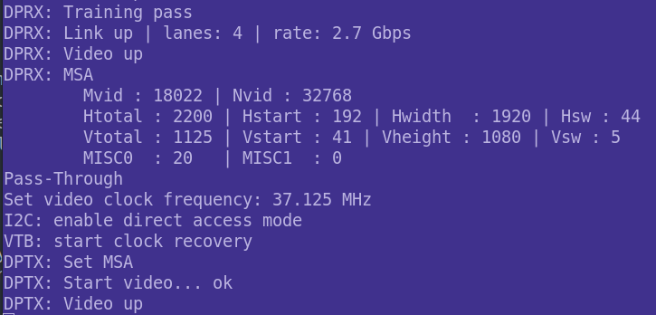

Reference Design
================

Introduction
------------
The reference design consists of the modules DisplayPort TX (DPTX), DisplayPort RX (DPRX), Video Toolbox (VTB), SERDES and application. 
The block diagram is shown below. 

The VTB is a collection of video helper modules. It has a timing generator, colorbar generator, FIFO and video clock recovery. 

The reference design has two operation modes; colorbar and pass-through. 
In colorbar mode the test pattern, generated by the VTB, is transmitted by the DPTX to the DisplayPort sink device.
When the pass-through mode is selected, the video coming from the DisplayPort source is captured by the DPRX. Then the video is forwarded to the DPTX through the VTB. 

The application has a RISC-V processor, memory (rom and ram) and a set of peripherals. 
The RISC-V processor runs the application code and DisplayPort IP-core host driver. 
The I2C peripheral is used to configure the external reference clock synthesizers (PHY and video clocks). 
The SERDES registers are accessed through the DRP / LMMI peripheral. 

Reference design

--------

Running
-------

This paragraph describes how to run the reference design on the board.

The reference design uses the `Tentiva board <https://www.parretto.com/tentiva.html>`_.
Tentiva is video FMC board with DisplayPort sink and source connectors.   
Mount the Tentiva board on the FMC HPC connector located on the FPGA development board. Use the plastic screws to secure the Tentiva board.

The reference design is available for the following platforms;

* `Xilinx Zynq UltraScale+ ZCU102 evalution board <https://www.xilinx.com/products/boards-and-kits/ek-u1-zcu102-g.html>`_
* `Lattice CertusPro-NX evaluation board <https://www.latticesemi.com/en/Products/DevelopmentBoardsAndKits/CertusPro-NXEvaluationBoard>`_

--------

Xilinx ZCU102 board setup

----

Lattice CertusPro-NX board setup

-----

Connect the external DisplayPort sink (eg. monitor) to the DPTX connector. This connector is labelled ``DPTX`` in the board picture. 
The DisplayPort source device (eg PC) is connected to the DPRX connector. This connector is labelled ``DPRX``.

Connect the host PC to the FPGA boards USB interface. 
Open a serial terminal and set the baudrate to 115200.
Download the FPGA bitstream into the FPGA using the FPGA vendor programming tool. 
After the FPGA was succesfully configured, you should see the welcome message on the terminal. 

|

The application shows the target FPGA board. Also it shows the Tentiva base- and mezzanine boards information. 

The application configures the DPTX and DPRX IP-cores. It pings the DPTX IP-core to verify the DPTX IP-core is up and running. 
Same is done for the DPRX IP-core. Additionally for the DPRX the edid is written and the hot plug detect (HPD) is asserted. 

Colorbar
~~~~~~~~
After the menu options, you should see that the DPTX detected the hot plug (HPD) and it succesfully trained the link. 
Press ``z`` for the colorbar mode. Then select one of the video resolutions. 
After selecting the video resolution the DPTX you should see the colorbar pattern on the DisplayPort sink device. 

|
|

Pass-through
~~~~~~~~~~~~
When the DisplayPort source video is enabled, you should see that the DPRX has succesfully trained and the link is up. 
Also it shows the detected incoming video parameters (in this example 1080p).
Press ``x`` to enable the pass-through mode. 
You should see the video from the DisplayPort source device displayed on the DisplayPort sink device. 

